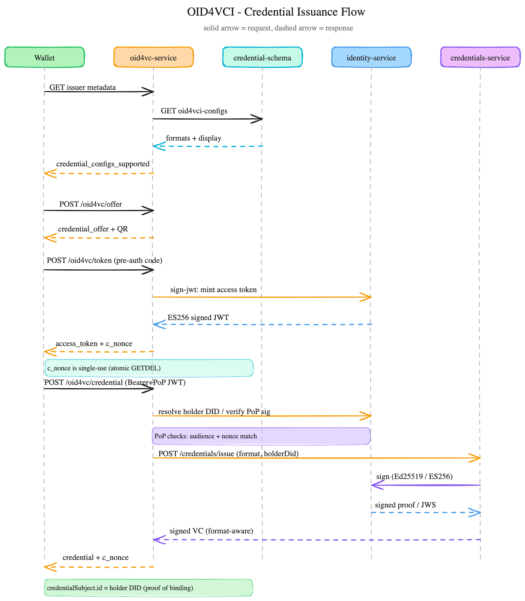
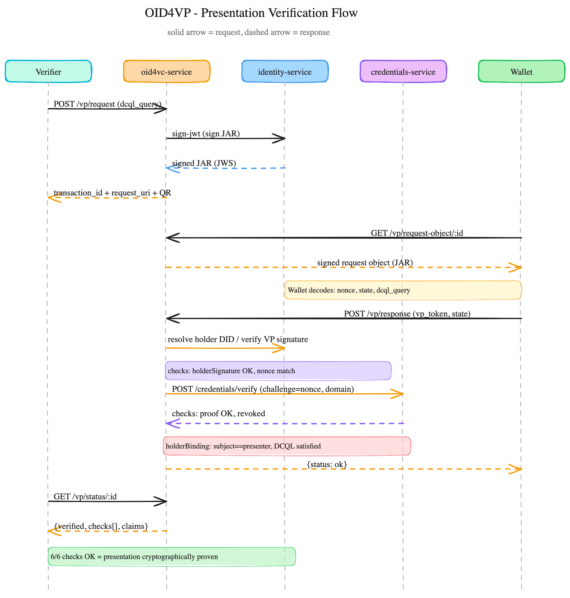

# oid4vc-service — API Flow Design (VC Issuance + VP Verification)

Visual sequence diagrams proving out the two protocol flows implemented by
`oid4vc-service`, drawn against the **actual endpoints and message shapes**
verified in `TESTING.md` (every request/response in that file was captured
from a live run of this stack).

## Diagrams

Legend used in both diagrams: **solid arrow = request**, **dashed arrow =
response**, colored note boxes = the security-critical checks performed at
that step. The point-wise breakdown below each image mirrors it exactly.

### OID4VCI — Credential (VC) Issuance

### OID4VP — Presentation (VP) Verification

---

## 1. OID4VCI — Credential Issuance Flow

**Actors (left → right):** Wallet · oid4vc-service · credential-schema · identity-service · credentials-service

### 1.1 Discovery
1. **Wallet → oid4vc-service**: `GET /.well-known/openid-credential-issuer`
2. **oid4vc-service → credential-schema**: `GET /credential-schema/oid4vci-configs` (live lookup, not cached across requests)
3. **credential-schema → oid4vc-service**: opted-in schemas with `formats`, `display`, `vct`
4. **oid4vc-service → Wallet**: `credential_configurations_supported` — one entry per `<schema>_<format>` combination (e.g. `OID4VC Pilot Credential_jwt_vc_json`)

### 1.2 Offer (pre-authorized_code grant)
5. **Wallet → oid4vc-service**: `POST /oid4vc/offer` `{credential_configuration_id, format, claims}`
6. **oid4vc-service → Wallet**: `credential_offer` (contains `credential_configuration_ids` matching the metadata key above) + QR data (`openid-credential-offer://...`)

### 1.3 Token exchange
7. **Wallet → oid4vc-service**: `POST /oid4vc/token` with `grant_type=urn:ietf:params:oauth:grant-type:pre-authorized_code&pre-authorized_code=...`
8. **oid4vc-service → identity-service**: `POST /utils/sign-jwt` — mints a 5-minute ES256 access token bound to the offer session
9. **identity-service → oid4vc-service**: signed JWT (`kid` = façade issuer DID)
10. **oid4vc-service → Wallet**: `{access_token, c_nonce, expires_in: 300, c_nonce_expires_in: 300}`

> **Security note (verified in TESTING.md N1):** the `pre-authorized_code` is
> single-use — an atomic store `GETDEL` consumes it. A replayed code returns
> `400 invalid_grant: bad or used code`.

### 1.4 Credential request (proof-of-possession)
11. **Wallet → oid4vc-service**: `POST /oid4vc/credential`, `Authorization: Bearer <access_token>`, body `{proof: {proof_type: "jwt", jwt: <PoP JWT>}}`
12. **oid4vc-service → identity-service**: resolve holder DID (if proof uses `kid`) and verify the PoP JWT signature

    **PoP checks performed:** `aud` == issuer public URL, `nonce` == live `c_nonce` (single-use, GETDEL'd on use). Either check failing returns a distinct `400` (`invalid_proof: PoP audience mismatch` / `invalid_or_missing_proof` with a fresh `c_nonce` for retry).

13. **oid4vc-service → credentials-service**: `POST /credentials/issue` `{credential, credentialSchemaId, format, holderJwk}` — holder DID injected as `credentialSubject.id` (or JWT `sub` for enveloped formats)
14. **credentials-service → identity-service**: `POST /utils/sign` (Ed25519, `ldp_vc`) **or** `POST /utils/sign-jwt` (ES256, `jwt_vc_json`)
15. **identity-service → credentials-service**: signed proof / compact JWS
16. **credentials-service → oid4vc-service**: signed VC (format-aware envelope)
17. **oid4vc-service → Wallet**: `{credential, c_nonce, format}`

> **Proof of holder binding:** decoding the returned `jwt_vc_json` credential
> shows `vc.credentialSubject.id` and top-level `sub` both equal to the
> holder DID that signed the PoP proof — this is the cryptographic evidence
> that the VC was bound to the wallet that requested it, not just anyone.

---

## 2. OID4VP — Presentation Verification Flow

**Actors (left → right):** Verifier · oid4vc-service · identity-service · credentials-service · Wallet

### 2.1 Verifier creates a request
1. **Verifier → oid4vc-service**: `POST /vp/request` `{dcql_query}`
2. **oid4vc-service → identity-service**: `POST /utils/sign-jwt` — signs the JAR (JWT-secured Authorization Request) with `nonce`, `state`, `dcql_query`, `response_uri`
3. **identity-service → oid4vc-service**: signed JAR
4. **oid4vc-service → Verifier**: `{transaction_id, request_uri, qr_data}` (`openid4vp://...`)

### 2.2 Wallet fetches and answers the request
5. **Wallet → oid4vc-service**: `GET /vp/request-object/:id`
6. **oid4vc-service → Wallet**: signed JAR (`Content-Type: application/oauth-authz-req+jwt`) — wallet decodes `nonce`, `state`, `dcql_query`, `response_uri`
7. **Wallet → oid4vc-service**: `POST /vp/response` (`direct_post`) `{state, vp_token}` — `vp_token` is a JWT signed by the holder's key, embedding `vp.verifiableCredential: [<VC>]` and the request's `nonce`

### 2.3 Verification chain (all inside `oid4vc-service`, delegating crypto)
8. **oid4vc-service → identity-service**: resolve holder DID from the VP token's `kid`/`iss`, verify the holder's signature over the VP token
   - check: `holderSignature == OK`
   - check: `nonce == txn.nonce` (replay protection — verified in TESTING.md N17)
9. **oid4vc-service → credentials-service**: `POST /credentials/verify` **per embedded VC**, with `options: {challenge: nonce, domain: publicUrl}` (P0.5 challenge/domain binding)
10. **credentials-service → oid4vc-service**: `{checks: [{proof, expired, revoked}]}`
    - check: `credentialSignatures == OK` (VC proof itself is valid, not tampered — verified in TESTING.md N12)
    - check: `revocation == OK` (status-list consulted if the VC carries `credentialStatus`)
    - check: `holderBinding == OK` — `credentialSubject.id` (or `sub`) of the embedded VC must equal the DID that signed the VP (verified in TESTING.md N19 — an impostor holding someone else's VC fails here)
    - check: `dcql == OK` — the DCQL query's requested claims/formats are all present in the disclosed credential(s) (verified in TESTING.md N18 — a query for a missing claim fails with a named reason)
11. **oid4vc-service → Wallet**: `{status: "ok"}` (or `403` with a `checks` map showing exactly which stage failed)

### 2.4 Verifier polls the result
12. **Verifier → oid4vc-service**: `GET /vp/status/:id`
13. **oid4vc-service → Verifier**: `{verified: true, checks: {holderSignature, nonce, credentialSignatures, holderBinding, revocation, dcql}, claims, holderDid}`

> **Proof of presentation:** all six checks returning `OK` together is the
> cryptographic proof that (a) the presenter controls the holder key, (b)
> the presented VC(s) are genuine, unrevoked, and bound to that same holder,
> and (c) the disclosed claims satisfy exactly what the verifier asked for
> via DCQL — nothing less, nothing forged.

---

## 3. Cross-reference to verified test evidence

Every numbered check above has a corresponding **executed** negative test in
`services/oid4vc-service/TESTING.md` §5 proving it actually rejects bad
input, not just that the happy path returns 200:

| Check | Proven by |
|---|---|
| pre-auth code single-use | N1 |
| PoP `nonce` binding | N5 |
| PoP `aud` binding | N6 |
| credential-config existence | N7 |
| format opt-in enforcement | N8 |
| VC signature tamper detection | N12 |
| VP `nonce` replay protection | N17 |
| DCQL satisfaction | N18 |
| VP holder-binding (impostor rejection) | N19 |
| VP transaction replay | N20 |

See `TESTING.md` for the exact commands and captured output for each.
