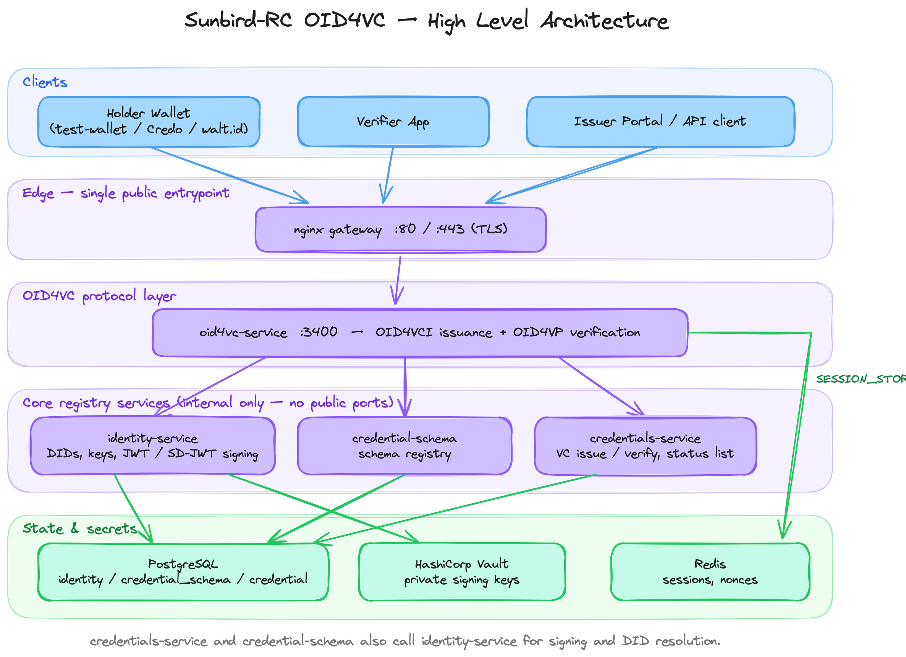
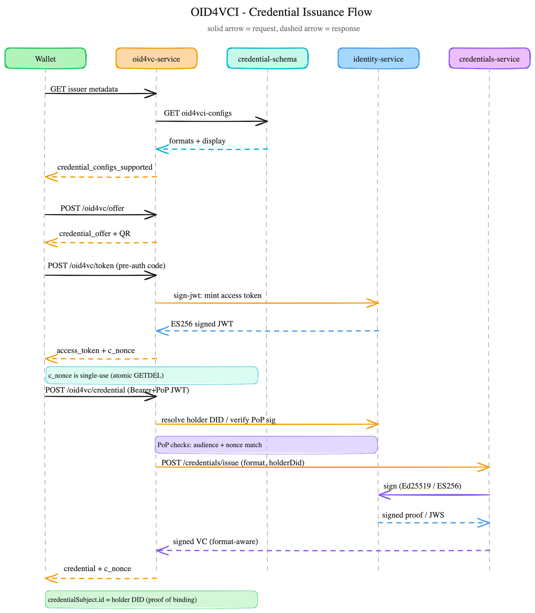
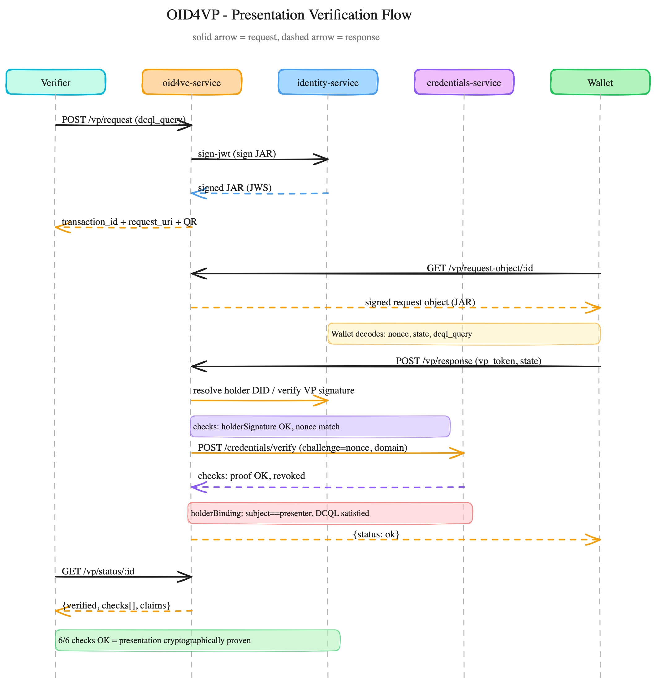

# oid4vc-service

OpenID4VCI 1.0 (with a draft-13 compat mode, `DRAFT13_COMPAT_MODE`) + OpenID4VP
1.0/draft-23 (credential presentation) **protocol façade** for Sunbird RC.
OID4VP defaults to a signed request object (JAR) with a `did:`-prefixed
`client_id`; set `OID4VP_LEGACY_CLIENT_ID_SCHEME=true` for the older,
unsigned, `client_id_scheme`-as-a-separate-field shape some wallets (e.g.
walt.id) still expect — see [§3.6](#36-verifier-creates-a-request).

It speaks the wallet protocols on the outside and delegates everything else
to the **existing, unchanged** services on the inside:

- **credentials-service** (`/credentials/issue`, `/credentials/verify`) — builds & signs the VC, stores it
- **identity-service** (`/utils/sign`, `/utils/sign-jwt`, `/utils/sign-sd-jwt`, `/utils/sign-mdoc`, `/did/resolve`, `/.well-known/jwks.json`) — all key operations (keys stay in Vault)
- **credential-schema** (`/credential-schema/oid4vci-configs`) — drives the issuer metadata

It holds **no credential keys and no credential storage** — only its own
OAuth/protocol signing key (delegated to identity-service) and short-lived
session state.

This document consolidates everything a new contributor or operator needs:
architecture, supported formats (including `mso_mdoc` and W3C VC Render
Method), the full API/sequence design, configuration reference, local
deployment, manual testing, production hardening, and end-to-end
verification evidence (including real-wallet interop results).

---

## Table of Contents

1. [Architecture](#1-architecture)
2. [Supported Credential Formats](#2-supported-credential-formats)
3. [API Flow Design](#3-api-flow-design)
4. [Configuration Reference](#4-configuration-reference)
5. [Local Deployment (Quick Start)](#5-local-deployment-quick-start)
6. [Manual Testing Guide](#6-manual-testing-guide)
7. [mso_mdoc & W3C VC Render Method](#7-mso_mdoc--w3c-vc-render-method)
8. [Production Deployment Guide](#8-production-deployment-guide)
9. [End-to-End Verification Evidence](#9-end-to-end-verification-evidence)

---

## 1. Architecture



**Key services involved (T2 topology — no Java registry needed):**

| Service | Port | Role |
|---|---|---|
| `db` (Postgres) | 5432 | shared DB, dedicated `identity`/`credential_schema`/`credential` databases |
| `vault` | 8200 | holds all signing keys (Ed25519, EC/ES256, EC P-256 for mdoc) |
| `redis` | 6379 | session store backend (optional; `memory` works for single instance) |
| `identity` | 3332 | DID generation/resolution, `/utils/sign*`, `/.well-known/jwks.json` |
| `credential-schema` | 3333 | schema CRUD, `oid4vciConfig` opt-in, `/credential-schema/oid4vci-configs` |
| `credential` | 3000 | `/credentials/issue`, `/credentials/verify` (format-aware) |
| `oid4vc-service` | 3400 | this service — `/oid4vc/*` (OID4VCI) and `/vp/*` (OID4VP) |

### Session store

Abstract interface (`src/session`) with two backends chosen by `SESSION_STORE`:
- `memory` — single-instance/test (default). Do **not** run multiple replicas with this.
- `redis` — production. Uses native TTL + atomic GETDEL for single-use codes/nonces.

### Draft-13 vs final-1.0

The core logic emits final OID4VCI/OID4VP 1.0 shapes. `DRAFT13_COMPAT_MODE=true`
switches the metadata (`credentials_supported`), the offer object's
`credentials` field, the offer grant (`user_pin_required`), and keeps
`c_nonce` in the token response — the idioms MOSIP Inji Wallet expects today.
This is isolated to `oid4vci.service.ts` so both shapes are covered without
branching the rest of the flow.

### Registry integration (who calls `POST /oid4vc/offer`)

`POST /oid4vc/offer` is designed to be called by an **issuer-side backend**,
not the wallet — the wallet only ever calls `GET /oid4vc/offer/:id`
(dereference), `POST /oid4vc/token`, and `POST /oid4vc/credential`. In this
repo, the Java registry is the intended caller, wired at two fail-open hook
points:

| Hook | File | Trigger |
|---|---|---|
| Entity create/update | `RegistryServiceImpl.java` (`generateCredentials()`) | Fires on both `addEntity()` and `updateEntity()` |
| Claim grant / attestation | `RegistryHelper.java` (`updateState()`, `GRANT_CLAIM` branch) | Fires when an attestation is granted with a `credentialTemplate` |

Both delegate to `java/registry/.../service/OID4VCIService.java`, gated by
`oid4vc.enabled` and `oid4vc.offerUrl` (see [§4](#4-configuration-reference)).
The `credential_configuration_id` passed is the entity's `vertexLabel` (e.g.
`"Teacher"`) for the create/update hook, or `"<sourceEntity>_<policyName>"`
for the claim-grant hook — this **must exactly match** the corresponding
`credential-schema` record's `name` (or its `schemaId`, see
[§4](#4-configuration-reference)), or offer creation 404s.

---

## 2. Supported Credential Formats

All four formats are supported and chosen per credential type via the
schema's `oid4vciConfig.oid4vciFormats`:

| Format | Signed by (identity-service) | Selective disclosure | Claim shape |
|---|---|---|---|
| `ldp_vc` | `/utils/sign` (Ed25519 linked-data proof) | ✖ | W3C `credentialSubject` |
| `jwt_vc_json` | `/utils/sign-jwt` (ES256 JWS, W3C VC-JWT convention) | ✖ | W3C `credentialSubject`, nested under a `vc` claim |
| `vc+sd-jwt` | `/utils/sign-sd-jwt` (ES256, IETF SD-JWT VC) | ✔ | Flat top-level claims, digests in `_sd` |
| `mso_mdoc` | `/utils/sign-mdoc` (ES256 COSE_Sign1, ISO/IEC 18013-5) | ✔ (per-element digests) | `{namespace: {elementIdentifier: value}}` |

`mso_mdoc` is covered in detail in [§7](#7-mso_mdoc--w3c-vc-render-method).

Credentials can also carry a **W3C VC Render Method**
(https://www.w3.org/TR/vc-render-method/) entry for visual rendering by
wallets — see [§7](#7-mso_mdoc--w3c-vc-render-method).

---

## 3. API Flow Design

Sequence diagrams for the two protocol flows this service implements.
Legend: **solid arrow = request**, **dashed arrow = response**.

### OID4VCI — Credential Issuance



**Actors (left → right):** Registry / Issuer · oid4vc-service · credential-schema · identity-service · credentials-service · Wallet

#### 3.1 Discovery
1. **Wallet → oid4vc-service**: `GET /.well-known/openid-credential-issuer`
2. **oid4vc-service → credential-schema**: `GET /credential-schema/oid4vci-configs` (live lookup, not cached)
3. **credential-schema → oid4vc-service**: opted-in schemas with `formats`, `display`, `vct`, `docType`/`namespace` (mdoc), `renderMethod`
4. **oid4vc-service → Wallet**: `credential_configurations_supported` — one entry per `<schemaId>_<format>` combination

#### 3.2 Offer creation (issuer-side, pre-authorized_code grant)
5. **Registry/Issuer → oid4vc-service**: `POST /oid4vc/offer` `{credential_configuration_id, format, claims}` — fire-and-forget, fail-open
6. **oid4vc-service → Registry/Issuer**: `{offer_id, credential_offer_uri, credential_offer, qr_data}`

`credential_configuration_id` can be either the schema's stable `schemaId`
(e.g. `did:schema:...` — always unambiguous, recommended) or its display
`name` (kept for convenience; falls back to whichever schema variant
actually supports the requested `format` if multiple schemas share a name).

#### 3.3 Wallet dereferences the offer
7. **Wallet → oid4vc-service**: `GET /oid4vc/offer/:id`
8. **oid4vc-service → Wallet**: `credential_offer` — `{credential_configuration_ids, grants: {"urn:ietf:params:oauth:grant-type:pre-authorized_code": {"pre-authorized_code": ...}}}`

#### 3.4 Token exchange
9. **Wallet → oid4vc-service**: `POST /oid4vc/token` (`grant_type=urn:ietf:params:oauth:grant-type:pre-authorized_code&pre-authorized_code=...`)
10. **oid4vc-service → identity-service**: `POST /utils/sign-jwt` — mints a 5-minute ES256 access token
11. **oid4vc-service → Wallet**: `{access_token, c_nonce, expires_in: 300, c_nonce_expires_in: 300}`

The `pre-authorized_code` is single-use — an atomic store `GETDEL` consumes
it; a replayed code returns `400 invalid_grant: bad or used code`.

#### 3.5 Credential request (proof-of-possession)
12. **Wallet → oid4vc-service**: `POST /oid4vc/credential`, `Authorization: Bearer <access_token>`, body `{proof: {proof_type: "jwt", jwt: <PoP JWT>}}`
13. **oid4vc-service**: verifies the PoP JWT (`aud` == issuer public URL, `nonce` == live single-use `c_nonce`; resolves holder DID via `kid` or accepts an inline `jwk`/`did:jwk`)
14. **oid4vc-service → credentials-service**: `POST /credentials/issue` `{credential, credentialSchemaId, format, holderJwk, docType?, namespaces?}` — holder key bound as `credentialSubject.id` / JWT `sub` / SD-JWT `cnf.jwk` / mdoc `deviceKeyInfo.deviceKey` depending on format
15. **credentials-service → identity-service**: format-appropriate signing call
16. **credentials-service → oid4vc-service**: signed VC (format-aware envelope)
17. **oid4vc-service → Wallet**: `{credential, c_nonce, format}`

### OID4VP — Presentation Verification



**Actors (left → right):** Verifier · oid4vc-service · identity-service · credentials-service · Wallet

#### 3.6 Verifier creates a request
1. **Verifier → oid4vc-service**: `POST /vp/request` `{dcql_query}`
2. **oid4vc-service → Verifier**: `{transaction_id, request_uri, qr_data}` (`openid4vp://...`)

By default the request object is a **signed JAR** (draft-23 / OID4VP 1.0):
`client_id` is `did:<VERIFIER_DID>`, `iss`/`aud` are set, and it's signed via
identity-service (`IdentityClient.signJwt`) — no key material lives in
oid4vc-service itself. Two alternate modes, chosen via config or a per-request
`{"signed": false}`:

| Mode | `client_id` | Signing | When |
|---|---|---|---|
| `signed` (default) | `did:<VERIFIER_DID>` | JWS, `application/oauth-authz-req+jwt` | `OID4VP_SIGN_REQUEST` unset/`true` |
| `unsigned` | `redirect_uri:<response_uri>` | none, plain JSON | `{"signed": false}` per request |
| `legacy` | `<response_uri>` + separate `client_id_scheme: "redirect_uri"` | none, plain JSON | `OID4VP_LEGACY_CLIENT_ID_SCHEME=true` |

The `redirect_uri` client_id scheme (`unsigned`/`legacy`) MUST NOT be signed
per spec, so signing forces the `did:` prefix — the mode is fixed at
`POST /vp/request` time, before `client_id` is baked into the QR deep link,
rather than negotiated later on the GET.

The `legacy` shape matches what walt.id's wallet parses today: it targets an
older OID4VP draft where `client_id_scheme` is a separate field and rejected
both a signed `did:` client_id and the prefixed `redirect_uri:` form during
interop testing (see `oid4vp.service.ts`'s `buildRequestObject` comment).

#### 3.7 Wallet fetches and answers the request
3. **Wallet → oid4vc-service**: `GET /vp/request-object/:id`
4. **oid4vc-service → Wallet**: a JWS (`application/oauth-authz-req+jwt`) for `signed`, or plain JSON containing `nonce`, `state`, `dcql_query`, `client_id`, `response_uri` for `unsigned`/`legacy`. The endpoint returns `406` if the wallet's `Accept` header excludes the transaction's actual representation.
5. **Wallet → oid4vc-service**: `POST /vp/response` (`direct_post`) `{state, vp_token}`

For `ldp_vc`/`jwt_vc_json`/`vc+sd-jwt`, `vp_token` is a JWT signed by the
holder's key, embedding `vp.verifiableCredential: [<VC>]` and the request's
`nonce`. For `mso_mdoc`, `vp_token` is instead a base64url-encoded CBOR
`DeviceResponse` (see [§7](#7-mso_mdoc--w3c-vc-render-method)) — a
structurally different presentation shape, since mdoc has its own
device-binding and session-transcript mechanism rather than a JWT wrapper.

#### 3.8 Verification chain
6. **oid4vc-service**: verifies holder/device signature, checks `nonce`/session-transcript freshness, verifies each embedded credential's signature + revocation status + holder binding (via `credentials-service /verify` for the JOSE/JSON-LD formats, or `@auth0/mdl`'s `Verifier` for mdoc), then evaluates the DCQL query against the disclosed claims
7. **oid4vc-service → Wallet**: `{status: "ok"}` (or `403` with a `checks` map showing exactly which stage failed)

#### 3.9 Verifier polls the result
8. **Verifier → oid4vc-service**: `GET /vp/status/:id`
9. **oid4vc-service → Verifier**: `{verified: true, checks: {holderSignature, nonce, credentialSignatures, holderBinding, revocation, dcql}, claims, holderDid}`

All six checks returning `OK` together is the cryptographic proof that (a)
the presenter controls the holder/device key, (b) the presented VC(s) are
genuine, unrevoked, and bound to that same holder, and (c) the disclosed
claims satisfy exactly what the verifier asked for via DCQL.

---

## 4. Configuration Reference

### 4.1 `oid4vc-service`

| Env var | Default | Purpose |
|---|---|---|
| `PORT` | `3400` | listen port |
| `PUBLIC_URL` | `http://localhost:3400` | **must be the externally-reachable HTTPS URL in production** — embedded as `iss`/`aud` in minted tokens, request objects, and PoP checks |
| `CREDENTIAL_SERVICE_BASE_URL` | `http://localhost:3000` | credentials-service |
| `IDENTITY_BASE_URL` | `http://localhost:3332` | identity-service |
| `SCHEMA_BASE_URL` | `http://localhost:3333` | credential-schema |
| `SESSION_STORE` | `memory` | `redis` required for any multi-replica deployment |
| `REDIS_URL` | `redis://localhost:6379` | required when `SESSION_STORE=redis` |
| `ISSUER_DID` | *(blank → auto-generated on boot)* | fallback issuer DID used for schemas that don't declare their own `author`. Should be pinned in production — an auto-generated ephemeral DID changes on every restart. |
| `OID4VP_ENABLED` | `true` | mounts `/vp/*` routes; set `false` to run issuance-only |
| `DRAFT13_COMPAT_MODE` | `false` | emit OID4VCI draft-13 shapes (Inji interop) |
| `OID4VP_SIGN_REQUEST` | `true` | sign the OID4VP request object as a JAR (`did:` client_id). Ignored (forced off) when `OID4VP_LEGACY_CLIENT_ID_SCHEME=true`, since the `redirect_uri` client_id scheme must not be signed. |
| `OID4VP_LEGACY_CLIENT_ID_SCHEME` | `false` | emit the pre-draft-22 shape (`client_id` = `response_uri`, separate `client_id_scheme: "redirect_uri"` field, unsigned) for wallets like walt.id that don't parse the prefixed `client_id` convention |
| `VERIFIER_DID` | *(blank → falls back to the issuer DID **only if** that is a `did:web`)* | DID used to sign OID4VP request objects when `OID4VP_SIGN_REQUEST` is on. Must be resolvable **by wallets** — see the note below. |

**Signing requires a wallet-resolvable DID.** When `OID4VP_SIGN_REQUEST` is on,
the request object's `client_id` is a `did:` and the wallet must resolve that
DID to verify the signature. The issuer DID is typically a **`did:rcw`** —
that's the method in the documented `ISSUER_DID` setup step, and also what gets
auto-provisioned when `ISSUER_DID` is blank — and a `did:rcw` is resolvable only
from identity-service's own DB, so no third-party wallet can verify against it.
`createRequest` therefore refuses to sign with a `did:rcw` (whether it came from
`ISSUER_DID` or was auto-provisioned) and returns a `500` naming the fix, rather
than emitting a signed request no wallet can verify.

An explicitly-set `VERIFIER_DID` is treated as the operator's deliberate choice
and used regardless of method. So for signing: set `VERIFIER_DID` to something
wallets can resolve (a `did:web`), or set `OID4VP_SIGN_REQUEST=false`. The
bundled `docker-compose.yml` dev stack opts out for exactly this reason.
| `OFFER_TTL` | `600`s | offer session lifetime |
| `NONCE_TTL` | `300`s | `c_nonce` lifetime (single-use regardless) |
| `ACCESS_TOKEN_TTL` | `300`s | façade-minted access token lifetime |
| `DEFERRED_TTL` | `86400`s | deferred-issuance transaction lifetime |
| `VP_TXN_TTL` | `300`s | OID4VP request/response transaction lifetime |

**Per-schema issuer DID:** every credential schema declares an `author` DID
at creation time. `oid4vc-service` signs each credential using that schema's
own `author` DID (falling back to `ISSUER_DID` only if the schema has none) —
so different schemas can be issued by different identities without a
redeploy.

### 4.2 `identity-service`

| Env var | Purpose |
|---|---|
| `DATABASE_URL` | dedicated DB (do not share with the Java registry's schema) |
| `VAULT_ADDR` / `VAULT_API_ADDR` / `VAULT_ADDRESS` | Vault reachability |
| `VAULT_TOKEN` | scoped policy token in production, not the root token |
| `VAULT_BASE_URL` | e.g. `http://vault:8200/v1/` |
| `VAULT_ROOT_PATH` | KV mount path, e.g. `kv` |
| `SIGNING_ALGORITHM` | e.g. `Ed25519Signature2020` — governs the JSON-LD (`ldp_vc`) path; ES256/EC keys for the other formats are generated per-DID on demand |
| `ENABLE_AUTH` | enforced here via `src/auth/auth.guard.ts` |
| `WEB_DID_BASE_URL` | only relevant if issuing `did:web` identifiers |

**DID key types**, chosen via `/did/generate`'s `keyPairType`:

| `keyPairType` | Used for |
|---|---|
| `Ed25519VerificationKey2020` / `2018` | `ldp_vc` |
| `RsaVerificationKey2018` | RSA-based `ldp_vc` |
| `JsonWebKey2020` (EC P-256) | `mso_mdoc` issuance — mandatory, since mdoc's COSE_Sign1 requires ES256 |

ES256 JWK keys for `jwt_vc_json`/`vc+sd-jwt` are provisioned automatically
per-DID on first use; no separate generation step is needed for those two.

### 4.3 `credential-schema`

Per-schema OID4VCI opt-in is set via the schema payload's `oid4vciConfig`:

```json
"oid4vciConfig": {
  "oid4vciEnabled": true,
  "oid4vciFormats": ["ldp_vc", "jwt_vc_json", "vc+sd-jwt", "mso_mdoc"],
  "vct": "...",
  "display": [{ "name": "...", "locale": "en-US" }],
  "mdoc": { "docType": "org.iso.18013.5.1.mDL", "namespace": "org.iso.18013.5.1" },
  "renderMethod": { "type": "SvgRenderingTemplate", "svg": "<svg>...</svg>" }
}
```

`mdoc` and `renderMethod` are detailed in [§7](#7-mso_mdoc--w3c-vc-render-method).
`GET /credential-schema/oid4vci-configs` lists everything currently opted in.

### 4.4 `credentials-service`

| Env var | Purpose |
|---|---|
| `DATABASE_URL` | dedicated DB |
| `IDENTITY_BASE_URL` / `SCHEMA_BASE_URL` | dependency URLs |
| `STATUS_LIST_ENABLED` | turns on `credentialStatus`/revocation-list checks — recommended `true` in production so OID4VP's `revocation` check means something |

### 4.5 Java registry (optional — only if wiring automatic offers)

| Env var | Default | Purpose |
|---|---|---|
| `oid4vc_enabled` | `false` | turns on the offer-creation hooks |
| `oid4vc_offer_url` | `http://localhost:3400/oid4vc/offer` | must be the container/network-reachable URL, e.g. `http://oid4vc-service:3400/oid4vc/offer` |

Also required (pre-existing V2 signing prerequisites): `signature_enabled=true`,
`signature_provider=dev.sunbirdrc.registry.service.impl.SignatureV2ServiceImpl`,
and (for attestation-triggered issuance) `did_enabled=true`, `claims_enabled=true`.

### 4.6 nginx (public gateway)

| Location | Proxies to |
|---|---|
| `/oid4vc` | `oid4vc-service:3400` (offer, token, nonce, credential, deferred, notification) |
| `/vp` | `oid4vc-service:3400` |
| `/.well-known/openid-credential-issuer` etc. | issuer/AS metadata |
| `/contexts` | dynamic JSON-LD context documents (for `ldp_vc` custom claims) |
| `/render-templates` | W3C VC Render Method inline SVG templates |

---

## 5. Local Deployment (Quick Start)

### 5.1 Prerequisites

- Docker Desktop running, `docker compose` v2 available.
- On Apple Silicon / arm64 hosts: `identity`, `credential-schema`, and
  `credential` use Prisma 4.8.1, which has no native arm64-musl (Alpine)
  query engine — build these **with `--platform linux/amd64`**.
  `oid4vc-service` itself has no native deps and builds natively on any arch.

### 5.2 Create `.env` (repo root)

```
RELEASE_VERSION=latest
POSTGRES_PASSWORD=postgres
VAULT_TOKEN=
VAULT_ADDR=http://vault:8200
VAULT_API_ADDR=http://vault:8200
VAULT_ADDRESS=http://vault:8200
VAULT_BASE_URL=http://vault:8200/v1/
VAULT_ROOT_PATH=kv
VAULT_TIMEOUT=5000
VAULT_PROXY=false
IDENTITY_BASE_URL=http://identity:3332
SCHEMA_BASE_URL=http://credential-schema:3333
CREDENTIAL_SERVICE_BASE_URL=http://credential:3000
SIGNING_ALGORITHM=Ed25519Signature2020
WEB_DID_BASE_URL=http://localhost:3332
ENABLE_AUTH=false

OID4VC_PUBLIC_URL=http://localhost:3400
OID4VC_REDIS_URL=redis://redis:6379
OID4VC_SESSION_STORE=memory
OID4VC_ISSUER_DID=
OID4VP_ENABLED=true
OID4VC_DRAFT13_COMPAT=false
```

### 5.3 Build the V2 service images (arm64 hosts: add `--platform linux/amd64`)

```bash
docker build --platform linux/amd64 -t sunbird-rc-identity:local ./services/identity-service
docker build --platform linux/amd64 -t sunbird-rc-credential-schema:local ./services/credential-schema
docker build --platform linux/amd64 -t sunbird-rc-credential:local ./services/credentials-service
```

### 5.4 Bring up the base + V2 stack (no Java registry required)

```bash
docker compose up -d db vault redis
bash enable-v2.sh     # initializes/unseals vault, creates per-service DBs,
                       # starts identity -> credential-schema -> credential in order
docker ps --format '{{.Names}}\t{{.Status}}'   # expect all "healthy"
```

### 5.5 Build and deploy oid4vc-service

```bash
docker compose --profile oid4vc up -d --build oid4vc-service
curl -s http://localhost:3400/health
# {"status":"UP","service":"oid4vc-service"}
```

### 5.6 Run without Docker (dev iteration)

```bash
npm install
npm run build
npm run start:prod     # or start:dev for watch mode
# Swagger UI at /api
```

### 5.7 Cleanup

```bash
docker compose --profile oid4vc down
docker compose down
```

Vault unseal keys/root token are written to `keys.txt` at the repo root by
`enable-v2.sh` — gitignored; delete it when done if you'd rather not keep
dev secrets on disk.

---

## 6. Manual Testing Guide

Step-by-step commands to exercise every flow manually, useful for
onboarding and regression-checking after changes.

> **Automated regression suite:** `oid4vc-service.postman_collection.json`
> (this folder) covers discovery, the full `jwt_vc_json` issuance flow,
> OID4VP presentation, `mso_mdoc` issuance + verification, W3C VC Render
> Method (including digest verification), and negative cases. Run it with
> Postman's Collection Runner or headless via
> `npx newman run oid4vc-service.postman_collection.json` (override the
> `*_base` variables with `--env-var` to point at a remote deployment).
> mdoc *presentation* is not in the collection — it needs a CBOR
> `DeviceResponse` a Postman sandbox can't build; that half is covered by
> the e2e harness ([§9](#9-end-to-end-verification-evidence)).

### 6.1 Health & discovery

```bash
curl -s http://localhost:3400/health
curl -s http://localhost:3400/.well-known/openid-credential-issuer
curl -s http://localhost:3400/.well-known/openid-configuration
curl -s http://localhost:3400/.well-known/jwks.json
```

`jwks.json` returns `{"keys":[]}` until the façade mints its first access
token — its signing key is generated lazily on first use.

### 6.2 Generate an issuer DID

```bash
curl -s -X POST http://localhost:3332/did/generate -H "Content-Type: application/json" \
  -d '{"content":[{"alsoKnownAs":["oid4vc-pilot-issuer"],"services":[],"method":"rcw"}]}'
```

Save the returned `id` as `$ISSUER_DID`. For `mso_mdoc` schemas, add
`"keyPairType":"JsonWebKey2020"` to generate an EC P-256 key instead.

### 6.3 Opt a schema into OID4VCI

```bash
curl -s -X POST http://localhost:3333/credential-schema -H "Content-Type: application/json" -d '{
  "schema": {
    "type": "https://w3c-ccg.github.io/vc-json-schemas/",
    "version": "1.0.0",
    "id": "<uuid>",
    "name": "OID4VC Pilot Credential",
    "author": "'"$ISSUER_DID"'",
    "authored": "2026-07-22T00:00:00.000Z",
    "schema": {
      "$id": "OID4VC-Pilot-Credential-1.0",
      "$schema": "https://json-schema.org/draft/2019-09/schema",
      "type": "object",
      "properties": {"name": {"type": "string"}},
      "required": ["name"],
      "additionalProperties": true
    }
  },
  "tags": ["oid4vc-pilot"],
  "status": "PUBLISHED",
  "oid4vciConfig": {
    "oid4vciEnabled": true,
    "oid4vciFormats": ["ldp_vc", "jwt_vc_json"],
    "display": [{"name": "OID4VC Pilot Credential", "locale": "en-US"}]
  }
}'
curl -s http://localhost:3333/credential-schema/oid4vci-configs
```

### 6.4 Full pre-authorized_code issuance flow (`jwt_vc_json`)

**1 — create the offer** (use the schema's `schemaId` from step 6.3's
response, or its `name`):
```bash
curl -s -X POST http://localhost:3400/oid4vc/offer -H "Content-Type: application/json" -d '{
  "credential_configuration_id": "OID4VC Pilot Credential",
  "format": "jwt_vc_json",
  "claims": {"name": "Test Holder"}
}'
```
Save `pre-authorized_code` as `$CODE`.

**2 — exchange the code for a token:**
```bash
curl -s -X POST http://localhost:3400/oid4vc/token \
  -H "Content-Type: application/x-www-form-urlencoded" \
  -d "grant_type=urn:ietf:params:oauth:grant-type:pre-authorized_code&pre-authorized_code=$CODE"
```
Save `access_token` as `$TOKEN` and `c_nonce` as `$NONCE`.

**3 — build a holder PoP JWT** (inline JWK, self-contained holder key):
```js
// node REPL, or a small script
const jose = require("jose");
const { publicKey, privateKey } = await jose.generateKeyPair("ES256", { extractable: true });
const publicJwk = await jose.exportJWK(publicKey);
publicJwk.alg = "ES256";
const jwt = await new jose.SignJWT({ aud: "http://localhost:3400", nonce: "<c_nonce>" })
  .setProtectedHeader({ alg: "ES256", typ: "openid4vci-proof+jwt", jwk: publicJwk })
  .setIssuedAt()
  .sign(privateKey);
```

**4 — request the credential:**
```bash
curl -s -X POST http://localhost:3400/oid4vc/credential \
  -H "Authorization: Bearer $TOKEN" -H "Content-Type: application/json" \
  -d '{"proof":{"proof_type":"jwt","jwt":"'"$POP_JWT"'"}}'
```
Decoding the returned JWT shows `vc.credentialSubject.id`/`sub` set to the
holder's `did:jwk:...`, proving holder binding.

**5 — verify the issued credential:**
```bash
curl -s -X POST http://localhost:3000/credentials/verify \
  -H "Content-Type: application/json" \
  -d '{"verifiableCredential":"<the credential string from step 4>"}'
# {"checks":[{"expired":"OK","proof":"OK"}]}
```

### 6.5 Full OID4VP verifier flow

**1 — verifier creates a DCQL presentation request:**
```bash
curl -s -X POST http://localhost:3400/vp/request -H "Content-Type: application/json" -d '{
  "dcql_query": {
    "credentials": [
      {"id": "pilot_cred", "format": "jwt_vc_json", "meta": {"type_values": [["VerifiableCredential", "OID4VC Pilot Credential"]]}, "claims": [{"path": ["credentialSubject", "name"]}]}
    ]
  }
}'
```

**2 — wallet fetches the request object:**
```bash
curl -s http://localhost:3400/vp/request-object/<id>
```

**3 — wallet builds and submits the vp_token** (a JWT signed by the same
holder key, embedding `vp.verifiableCredential: [<credential>]` and the
request's `nonce`), then:
```bash
curl -s -X POST http://localhost:3400/vp/response -H "Content-Type: application/json" \
  -d '{"state":"<state>","vp_token":"<signed vp jwt>"}'
```

**4 — verifier polls the result:**
```bash
curl -s http://localhost:3400/vp/status/<transaction_id>
```
```json
{
  "status": "verified",
  "verified": true,
  "checks": {
    "holderSignature": "OK", "nonce": "OK", "credentialSignatures": "OK",
    "holderBinding": "OK", "revocation": "OK", "dcql": "OK"
  },
  "claims": {"pilot_cred": {"name": "Test Holder"}},
  "holderDid": "did:jwk:..."
}
```

### 6.6 Error responses reference

| Scenario | Response |
|---|---|
| Reuse a `pre-authorized_code` | `400 {"message":"invalid_grant: bad or used code"}` |
| Missing `proof.jwt` | `400 {"message":"Missing proof.jwt"}` |
| Invalid/garbage bearer token | `401 {"message":"Invalid access token"}` |
| No `Authorization` header | `401 {"message":"Missing bearer token"}` |
| PoP `nonce` mismatch | `400 {"error":"invalid_or_missing_proof","c_nonce":"<fresh nonce>"}` |
| PoP `aud` mismatch | `400 {"message":"invalid_proof: PoP audience mismatch"}` |
| Unknown `credential_configuration_id` | `404 {"message":"Credential configuration 'X' not enabled for OID4VCI"}` |
| Format not enabled for that schema | `400 {"message":"Format 'X' not supported for this credential"}` |
| Unknown/expired offer id | `404 {"message":"Offer not found or expired"}` |
| Unsupported `grant_type` | `400 {"message":"unsupported_grant_type"}` |
| Tampered credential on verify | `200 {"checks":[{"expired":"OK","proof":"NOK"}]}` |
| VP with unknown/bogus `state` | `400 {"message":"unknown or expired state"}` |
| VP missing `state` | `400 {"message":"missing state"}` |
| Unknown VP transaction | `404 {"message":"VP transaction not found"}` |
| VP token with wrong `nonce` | `403 {"error":"Error: nonce mismatch"}` |
| DCQL claim not present | `403 {"error":"Error: DCQL not satisfied: claim X missing for query Y"}` |
| Holder-binding mismatch (impostor) | `403 {"error":"Error: holder binding failed: subject != presenter"}` |
| Replay an already-verified VP | `400 {"message":"transaction not pending"}` |

Every VP failure returns a partial `checks` map showing exactly which
validations passed before the failing one — useful for pinpointing what a
real wallet/verifier got wrong.

---

## 7. `mso_mdoc` & W3C VC Render Method

### 7.1 `mso_mdoc` (ISO/IEC 18013-5 mobile documents)

Unlike the other three formats, `mso_mdoc` is CBOR-encoded and COSE-signed
(not JOSE/JSON-LD), organizes claims under
`{docType, namespaces: {namespace: {elementIdentifier: value}}}` instead of
a flat `credentialSubject`, and uses its own device-binding/session-transcript
mechanism for presentation rather than a JWT-VP wrapper. Built on
[`@auth0/mdl`](https://github.com/auth0-lab/mdl).

**Prerequisites:**
- The issuing DID must have an EC P-256 (`JsonWebKey2020`) verification
  method — generate one via `/did/generate` with
  `"keyPairType":"JsonWebKey2020"` (see [§4.2](#42-identity-service)).
- Issuance uses a fresh, self-signed X.509 certificate wrapping that key for
  each credential's COSE_Sign1 `issuerAuth` structure (this deployment has no
  external IACA root chain — verification correspondingly trusts the
  deployment's own DID keys directly, consistent with how the other three
  formats work).

**Schema config:**
```json
"oid4vciConfig": {
  "oid4vciEnabled": true,
  "oid4vciFormats": ["mso_mdoc"],
  "mdoc": {
    "docType": "org.iso.18013.5.1.mDL",
    "namespace": "org.iso.18013.5.1",
    "elementMapping": {
      "custom_claim_name": { "namespace": "org.iso.18013.5.1", "elementIdentifier": "given_name" }
    }
  }
}
```
- `docType` / `namespace` are required.
- `elementMapping` is optional — remaps a specific claim name to a different
  `{namespace, elementIdentifier}` pair when it doesn't already match an
  ISO-registered element identifier in the default namespace.

**Issuing and presenting** follow the same OID4VCI/OID4VP endpoints as the
other formats ([§3](#3-api-flow-design)/[§6](#6-manual-testing-guide)), with
two differences:
- The credential response's `credential` field is a base64url-encoded CBOR
  `IssuerSigned` structure instead of a JWT/SD-JWT string.
- The DCQL query for an mdoc credential uses `meta.doctype_value` (a single
  string, not an array) and 2-segment claim paths `[namespace,
  elementIdentifier]` (no `credentialSubject` prefix):
  ```json
  { "id": "mdl_cred", "format": "mso_mdoc", "meta": {"doctype_value": "org.iso.18013.5.1.mDL"}, "claims": [{"path": ["org.iso.18013.5.1", "given_name"]}] }
  ```
- The presentation `vp_token` is a base64url-encoded CBOR `DeviceResponse`
  (built with `@auth0/mdl`'s `DeviceResponse` class on the wallet side), and
  the `/vp/response` request body needs one extra field,
  `mdoc_generated_nonce` — a wallet-generated nonce folded into the mdoc
  session transcript alongside the request's own `nonce`/`client_id`/
  `response_uri`.

### 7.2 W3C VC Render Method

Lets a schema declare how its issued credentials should be visually
rendered by a wallet, per the
[W3C VC Render Method](https://www.w3.org/TR/vc-render-method/) spec.
Applies to `ldp_vc` and `jwt_vc_json` (both carry a full W3C-shaped VC
object); `vc+sd-jwt` and `mso_mdoc` have no analogous mechanism wired here.

**Schema config** — either reference an already-hosted template, or supply
inline SVG for `oid4vc-service` to host itself:
```json
"oid4vciConfig": {
  "renderMethod": {
    "type": "SvgRenderingTemplate",
    "name": "My Credential Card",
    "svg": "<svg xmlns='http://www.w3.org/2000/svg' ...>{{credentialSubject.name}}</svg>",
    "cssMediaQuery": "@media (min-width: 480px)"
  }
}
```
When `svg` is provided, it's served at `GET /render-templates/:schemaId`
and the issued credential's `renderMethod[0].id` points to that URL, with a
`digestMultibase` (multibase/multihash-encoded SHA-256 digest of the SVG
content) for wallets to verify the template hasn't been tampered with. When
`url` is provided instead, it's used as-is with no digest computed.

---

## 8. Production Deployment Guide

### 8.1 Hardening checklist

- **Restrict `POST /oid4vc/offer` to internal callers only.** There is no
  application-level authentication on this endpoint, by design — it's meant
  to be called only by the registry/issuer backend (see the Java registry's
  `OID4VCIService.createOfferSafely`), never by an end user or wallet, and it
  is trusted to hand back a signed, wallet-loadable credential for whatever
  `credential_configuration_id`/`claims` it's given. Enforcement is expected
  entirely at the network/gateway layer: keep it off the public nginx
  location used by the wallet-facing routes (`/oid4vc/offer/:id`, `/token`,
  `/credential`, `/nonce`, `/deferred`, `/notification`, `/vp/*` all still
  need to stay public) and put it behind an internal CIDR allowlist, mTLS, or
  a shared-secret header instead.
- **TLS + rate limiting on the public gateway.** OID4VCI/OID4VP both assume
  HTTPS in their metadata URLs and PoP/request-object audience checks. Add
  rate limiting at minimum on `/oid4vc/token`, `/oid4vc/credential`,
  `/oid4vc/nonce`, `/vp/response`.
- **Pin `ISSUER_DID`** (or ensure every schema declares its own `author`).
  An auto-generated ephemeral DID changes on every restart, invalidating
  every previously-minted access token.
- **`SESSION_STORE=redis`**, pointed at a persistent, access-controlled
  Redis instance — required for multi-replica deployments and recommended
  even for a single replica (survives restarts).
- **Vault production posture:** use a proper storage backend (Raft/Consul)
  and auto-unseal (cloud KMS) rather than file storage + manual unseal keys;
  enable TLS on Vault's listener; scope the token identity-service uses down
  to only the paths it needs.
- **`STATUS_LIST_ENABLED=true`** on `credentials-service` if revocation
  should mean anything for OID4VP's `revocation` check.
- **Key rotation:** decide and document a rotation cadence for the
  underlying DID keys — not implemented automatically.

### 8.2 Deployment procedure

```bash
# 1. .env with production values:
#    PUBLIC_URL=https://your-domain/oid4vc
#    SESSION_STORE=redis, REDIS_URL=<real redis>
#    ISSUER_DID=<pinned>
#    STATUS_LIST_ENABLED=true
#    oid4vc_enabled=true, oid4vc_offer_url=http://oid4vc-service:3400/oid4vc/offer  (registry only)

# 2. Bring up prerequisites
docker compose up -d db vault redis

# 3. Init/unseal vault (first run only), start identity/credential-schema/credential
bash enable-v2.sh

# 4. Build/deploy oid4vc-service
docker compose --profile oid4vc up -d --build oid4vc-service

# 5. Confirm health
curl -sf https://<your-domain>/health
curl -s https://<your-domain>/.well-known/openid-credential-issuer
```

Then apply the network-restriction and TLS/rate-limiting items above at the
nginx layer before exposing publicly, and opt in the schemas you intend to
issue via `oid4vciConfig` ([§4.3](#43-credential-schema)).

---

## 9. End-to-End Verification Evidence

### 9.1 Simulated (self-driven script) evidence

A self-driven Node.js script (using `jose` and `@auth0/mdl`) exercised the
complete issuance → verification → DCQL-gated presentation flow for all
four supported formats, directly against a deployed instance — generating
a holder/device key to stand in for a real wallet, so the results are
independent of any third-party wallet's own behavior.

| Format | Offer | Token | Credential Issue | Standalone Verify | VP Submit | Final Status |
|---|---|---|---|---|---|---|
| `ldp_vc` | ✅ 201 | ✅ 200 | ✅ 200 | ✅ proof: OK | ✅ 200 | ✅ **verified: true**, all 6 checks OK |
| `jwt_vc_json` | ✅ 201 | ✅ 200 | ✅ 200 | ✅ proof: OK | ✅ 200 | ✅ **verified: true**, all 6 checks OK |
| `vc+sd-jwt` | ✅ 201 | ✅ 200 | ✅ 200 | ✅ proof: OK | ✅ 200 | ✅ **verified: true**, all 6 checks OK |
| `mso_mdoc` | ✅ 201 | ✅ 200 | ✅ 200 | ✅ proof: OK | ✅ 200 | ✅ **verified: true**, all 6 checks OK |

Sample final status (`GET /vp/status/:id`) for each format:

<details>
<summary><code>ldp_vc</code> / <code>jwt_vc_json</code> / <code>vc+sd-jwt</code> — click to expand</summary>

```json
{
  "status": "verified",
  "verified": true,
  "checks": {
    "holderSignature": "OK", "nonce": "OK", "credentialSignatures": "OK",
    "holderBinding": "OK", "revocation": "OK", "dcql": "OK"
  },
  "claims": { "age_cred": { "name": "Full Flow Test", "age_over_18": true } }
}
```
</details>

<details>
<summary><code>mso_mdoc</code> — click to expand</summary>

```json
{
  "status": "verified",
  "verified": true,
  "checks": {
    "holderSignature": "OK", "nonce": "OK", "credentialSignatures": "OK",
    "holderBinding": "OK", "revocation": "OK", "dcql": "OK"
  },
  "claims": { "mdl_cred": { "org.iso.18013.5.1.given_name": "Jane" } }
}
```
</details>

All four formats complete the full issuance → verification → DCQL-gated
presentation flow correctly, end-to-end.

### 9.2 Real-wallet interop evidence

Beyond the simulated script above, the service has also been verified
against real, independently-implemented wallet apps:

- **[walt.id Wallet](https://walt.id/wallet)** — hosted demo wallet
  (`wallet.demo.walt.id`), no local deployment or intermediary backend. Its
  credential-offer acceptance API takes the same
  `openid-credential-offer://...` deep link this service produces, with no
  issuer pre-registration required.
  - **Issuance (Holder role):** `jwt_vc_json` and `vc+sd-jwt` — credential
    received into the wallet successfully.
  - **Presentation (Holder role):** `vc+sd-jwt` — walt.id answered a
    `POST /vp/request` DCQL query and `GET /vp/status/:id` returned
    `verified: true` with all six checks `OK`.
- **[Paradym Wallet](https://paradym.id)** — tested in the **OID4VP Holder
  role only** (this service acting as Verifier); no OID4VCI/Issuer-role
  testing was done against Paradym.
  - **Presentation (Holder role):** `jwt_vc_json` and `vc+sd-jwt` — both
    fully verified, `GET /vp/status/:id` returned `verified: true` with all
    six checks `OK`.

| Wallet | OID4VC Role Tested | Format(s) | Result |
|---|---|---|---|
| walt.id Wallet | Holder (OID4VCI issuance) | `jwt_vc_json`, `vc+sd-jwt` | ✅ credential received into wallet |
| walt.id Wallet | Holder (OID4VP presentation) | `vc+sd-jwt` | ✅ **verified: true**, all 6 checks OK |
| Paradym Wallet | Holder (OID4VP presentation) | `jwt_vc_json`, `vc+sd-jwt` | ✅ **verified: true**, all 6 checks OK |
